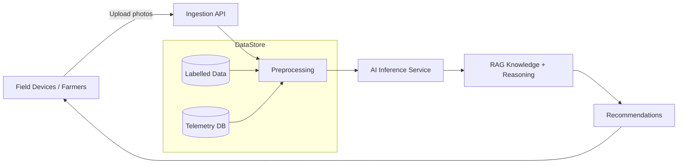
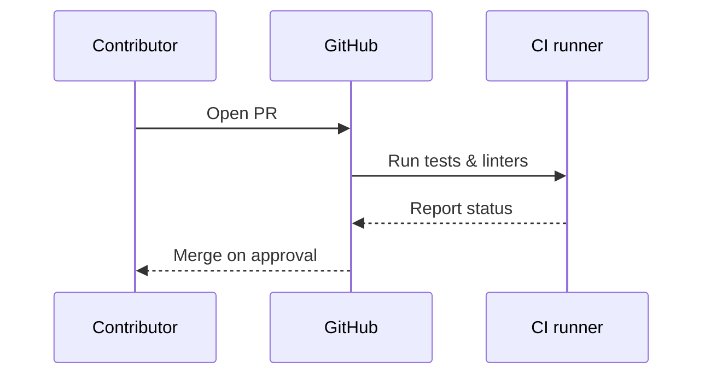
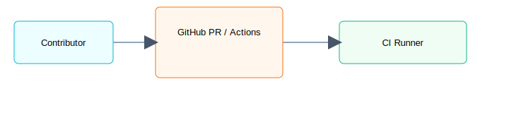

# BhoomiGuard AI Global


BhoomiGuard AI Global is an open, extensible platform for plant, soil and crop health monitoring using AI and Retrieval-Augmented Generation (RAG). It provides tools to collect field data, analyze imagery, run AI inference for disease and nutrient stress detection, and deliver actionable recommendations to farmers worldwide.

**Key features**

- Multi-modal data ingestion: satellite, drone, and mobile imagery, plus sensor telemetry and user reports.
- AI inference: on-device or cloud-hosted models for disease & nutrient detection.
- RAG knowledge layer: combine structured knowledge (databases) and unstructured docs to produce explainable recommendations.
- Feedback loop: user feedback and labeled cases improve models over time.
- Privacy-first design: supports local processing and minimal data sharing.

**Repository Contents**

- `README.md` — project overview and workflows
- `.github/workflows/ci.yml` — CI for tests and linting
- `images/` — SVG diagrams used by the README

**High-level architecture**



**Workflows (images + diagram)**

- Data flow and inference pipeline (image): `images/data-flow.svg`
- CI / contribution workflow (image): `images/ci-workflow.svg`


### CI / Contribution workflow





**Getting started**

1. Clone the repo and open it in VS Code.
2. Create a Python venv and install dependencies from `requirements.txt` (if present):

```bash
python -m venv .venv
.venv\Scripts\activate
pip install -r requirements.txt
```

3. Run tests:

```bash
pytest -q
```

**Next steps**

- Add model training scripts under `training/` and inference services under `services/`.
- Add sample datasets and labeling tools under `data/`.

---

If you want, I can initialize a Git repo here and push to GitHub (will need your remote and auth).
